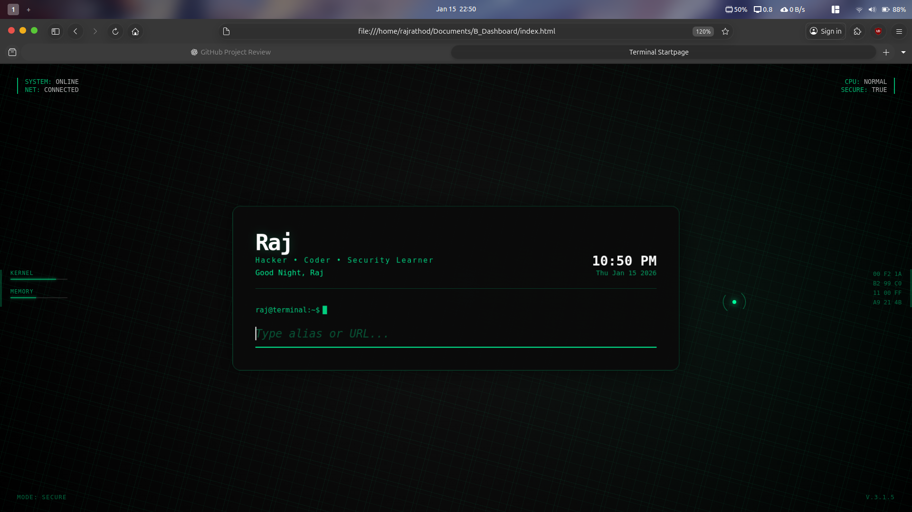

# 🚀 Terminal Startpage



A terminal-style browser startpage for power users. Users can execute commands, define aliases, open URLs, and search the web using a keyboard-driven interface.

---

## Features

- Terminal-style command input
- `config` command for user settings
- `ls -a` to list all commands
- Custom aliases (example: `gg`)
- DuckDuckGo search fallback
- Direct URL opening
- JSON backup & restore of configuration

---

## Browser Support

- Chromium-based browsers: Fully supported
- Firefox (Flatpak): Requires directory permissions

---

## Method 1: Local File (Recommended)

### 1️⃣ Download the Project

You can either:

- **Download ZIP** – Click **Code → Download ZIP** and extract it  
- **Or clone using Git**:

```bash
git clone https://github.com/rajrathod07/terminal-startpage.git
```

## 2️⃣ Open `index.html`

1. Open the project folder  
2. Double-click `index.html` to open in your browser  
3. Copy the file path URL from the browser’s address bar, for example: file:///home/user/terminal-startpage/index.html


## 3️⃣ Set as Homepage / New Tab

### 🟢 Chromium-Based Browsers (Chrome, Brave, Edge, Vivaldi)

1. Open **Settings**  
2. Go to **On startup**  
3. Select **Open a specific set of pages**  
4. Click **Add a new page**  
5. Paste the copied `file:///.../index.html` path  
6. Save ✅  

Your Terminal Startpage will now load on browser start.

### 🦊 Firefox (Flatpak Users – Important)

Flatpak Firefox cannot access local files by default.

1. Give directory permission by running:

# Allow access to your home folder
flatpak override --user --filesystem=home org.mozilla.firefox

# Or allow access only to the project folder
flatpak override --user --filesystem=/home/USERNAME/terminal-startpage org.mozilla.firefox

2. Restart Firefox

3. Open Settings → Home

4. Set Homepage and new windows → Custom URLs

5. Paste: file:///home/USERNAME/terminal-startpage/index.html

💾 Backup & Restore Configuration

Backup:

1. Type config in your startpage

2. Use the export / backup option

3. Save the JSON file safely

Restore:

1. Reopen startpage

2. Import the saved JSON file

3. All aliases & settings will be restored

⌨️ Example Commands

| Command       | Action             |
| ------------- | ------------------ |
| `ls -a`       | List all commands  |
| `config`      | Show user settings |
| `gg`          | Open Google        |
| `github`      | Open aliased site  |
| `example.com` | Open URL           |
| `random text` | DuckDuckGo search  |


